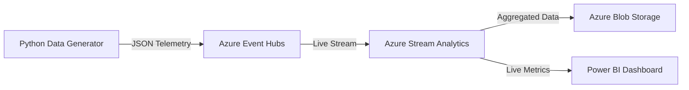

# SmartFactory: End-to-End Real-Time IoT Analytics on Azure

An end-to-end real-time data streaming pipeline designed to monitor and analyze industrial IoT sensor data. This project demonstrates the ingestion of high-velocity telemetry, real-time complex event processing (CEP), and scalable data persistence in the cloud.

## 🏗️ Architecture Overview

The system follows a modern decoupled architecture to ensure high availability and sub-second latency.



### 🛠️ The Tech Stack
*   **Data Generation:** Python 3.x (Simulating 10 industrial machines).
*   **Ingestion:** **Azure Event Hubs** (High-throughput event ingestion).
*   **Processing:** **Azure Stream Analytics** (Real-time SQL-based windowing).
*   **Storage:** **Azure Blob Storage** (Data Lake for historical persistence).
*   **Visualization:** **Power BI** (Real-time health & efficiency dashboard).

## 🚀 Key Features
*   **Real-Time Ingestion:** Handles continuous streams of sensor data (Temperature, Energy, Status).
*   **Windowed Aggregations:** Uses **Tumbling Windows (10s)** to calculate averages and totals on-the-fly.
*   **Anomaly Detection:** Real-time identification of "Critical" machine states based on temperature thresholds.
*   **Security First:** Implements **Environment Variables** for sensitive Azure Connection Strings, ensuring no secrets are hardcoded.

## 💻 How to Run This Project

### 1. Azure Setup
*   Create a **Resource Group** in Azure.
*   Deploy an **Event Hubs Namespace** (Basic Tier) and an Event Hub named `factory-data-hub`.
*   Deploy a **Stream Analytics Job** and a **Storage Account**.

### 2. Local Configuration
*   Clone this repository.
*   Install dependencies:
    ```bash
    pip install azure-eventhub
    ```
*   Set your connection string as an environment variable:
    ```bash
    # Windows
    $env:AZURE_EVENTHUB_CONN_STR = "your_connection_string"
    # Mac/Linux
    export AZURE_EVENTHUB_CONN_STR="your_connection_string"
    ```

### 3. Start the Stream
*   Run the simulation script:
    ```bash
    python scripts/data_generator.py
    ```
*   Start the **Stream Analytics Job** in the Azure Portal.

---
**Author:** Roshan Vinnarasau
**LinkedIn:** ```https://www.linkedin.com/in/roshan1602/
**Project Date:** July 2026
